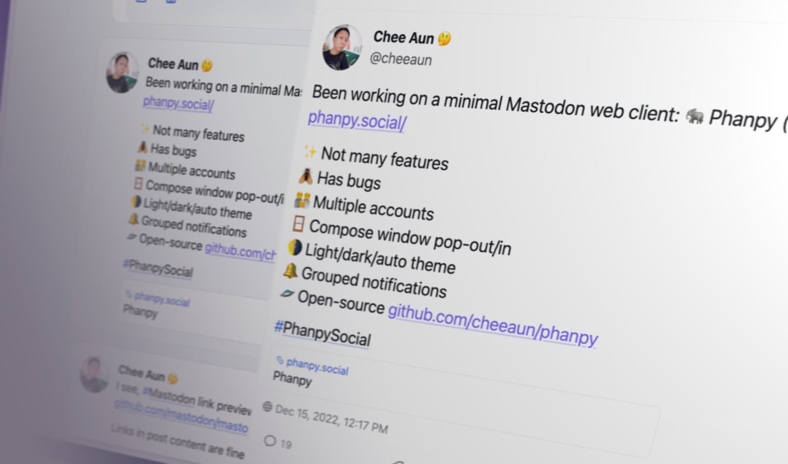
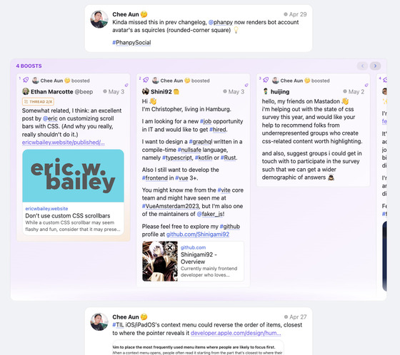

<div align="center">
  

Phanpy
===

**Minimalistic opinionated Mastodon web client.**
</div>



**🗣️ Pronunciation**: [`/fænpi/`](https://ythi.net/how-do-you-pronounce/phanpy/english/) ([`FAN-pee`](https://www.smogon.com/forums/threads/the-official-name-pronunciation-guide.3474941/)) [🔊 Listen](https://www.youtube.com/watch?v=DIUbWe-ysJI)

This is an alternative web client for [Mastodon](https://joinmastodon.org/).

- 🏢 **Production**: https://phanpy.social
  - `production` branch
  - break less often
  - slower fixes unless critical
- 🏗️ **Development**: https://dev.phanpy.social
  - `main` branch
  - may see new cool stuff sooner
  - may break more often
  - may be fixed much faster too

🐘 Follow [@phanpy on Mastodon](https://hachyderm.io/@phanpy) for updates ✨

Everything is designed and engineered following my taste and vision. This is a personal side project for me to learn about Mastodon and experiment with new UI/UX ideas.

## Features

- 👪 Multiple accounts
- 🪟 Compose window pop-out/in
- 🌗 Light/dark/auto theme
- 🔔 Grouped notifications
- 🪺 Nested comments thread
- 📬 Unsent draft recovery
- 🎠 Boosts Carousel™️
- ⚡ Shortcuts™️ with view modes like multi-column or tab bar
- #️⃣ Multi-hashtag timeline

## Design decisions

- **Status actions (reply, boost, favourite, bookmark, etc) are hidden by default**.<br>They only appear in individual status page. This is to reduce clutter and distraction. It may result in lower engagement, but we're not chasing numbers here.
- **Boost is represented with the rocket icon**.<br>The green double arrow icon (retweet for Twitter) doesn't look right for the term "boost". Green rocket looks weird, so I use purple.
- **Short usernames (`@username`) are displayed in timelines, instead of the full account username (`@username@instance`)**.<br>Despite the [guideline](https://docs.joinmastodon.org/api/guidelines/#username) mentioned that "Decentralization must be transparent to the user", I don't think we should shove it to the face every single time. There are also some [screen-reader-related accessibility concerns](https://twitter.com/lifeofablindgrl/status/1595864647554502656) with the full username, though this web app is unfortunately not accessible yet.
- **No autoplay for video/GIF/whatever in timeline**.<br>The timeline is already a huge mess with lots of people, brands, news and media trying to grab your attention. Let's not make it worse. (Current exception now would be animated emojis.)
- **Hash-based URLs**.<br>This web app is not meant to be a full-fledged replacement to Mastodon's existing front-end. There's no SEO, database, serverless or any long-running servers. I could be wrong one day.

## Subtle UI implementations

<details>
<summary>
<b>User name display</b>
</summary>


- On the timeline, the user name is displayed as `[NAME] @[username]`.
- For the `@[username]`, always exclude the instance domain name.
- If the `[NAME]` *looks the same* as the `@[username]`, then the `@[username]` is excluded as well.
</details>
<details>
<summary>
<b>Boosts Carousel</b>
</summary>



- From the fetched posts (e.g. 20 posts per fetch), if number of boosts are more than quarter of total posts or more than 3 consecutive boosts, boosts carousel UI will be triggered.
- If number of boosts are more than 3 quarters of total posts, boosts carousel UI will be slotted at the end of total posts fetched (per "page").
- Else, boosts carousel UI will be slotted in between the posts.

</details>

<details>
<summary>
<b>Thread number badge (e.g. Thread 1/X)</b>
</summary>


- Check every post for `inReplyToId` from cache or additional API requests, until the root post is found.
- If root post is found, badge will show the index number of the post in the thread.
- Limit up to 3 API requests as the root post may be very old or the thread is super long.
- If index number couldn't be found, badge will fallback to showing `Thread` without the number.
</details>

<details>
<summary>
<b>Hashtag stuffing collapsing</b>
</summary>


- First paragraph of post content with more than 3 hashtags will be collapsed to max 3 lines.
- Subsequent paragraphs after first paragraph with more than 3 hashtags will be collapsed to 1 line.
- Adjacent paragraphs with more than 1 hashtag after collapsed paragraphs will be collapsed to 1 line.
- If there are text around or between the hashtags, they will not be collapsed.
- Collapsed hashtags will be appended with `...` at the end.
- They are also slightly faded out to reduce visual noise.
- Opening the post view will reveal the hashtags uncollapsed.
</details>

<details>
<summary>
<b>Filtered posts</b>
</summary>

- "Hide completely"-filtered posts will be hidden, with no UI to reveal it.
- "Hide with a warning"-filtered posts will be partially hidden, showing the filter name and author name.
  - Content can be partially revealed by hovering over the post, with tooltip showing the post text.
  - Clicking it will open the Post page.
  - Long-pressing or right-clicking it will "peek" the post with a bottom sheet UI.
  - On boosts carousel, they are sorted to the end of the carousel.
</details>

## Development

Prerequisites: Node.js 20+

- `npm install` - Install dependencies
- `npm run dev` - Start development server and `messages:extract` (`clean` + `watch`) in parallel
- `npm run build` - Build for production
- `npm run preview` - Preview the production build
- `npm run fetch-instances` - Fetch instances list from [joinmastodon.org/servers](https://joinmastodon.org/servers), save it to `src/data/instances.json`
- `npm run sourcemap` - Run `source-map-explorer` on the production build
- `npm run messages:extract` - Extract messages from source files and update the locale message catalogs

## Tech stack

- [Vite](https://vitejs.dev/) - Build tool
- [Preact](https://preactjs.com/) - UI library
- [Valtio](https://valtio.pmnd.rs/) - State management
- [React Router](https://reactrouter.com/) - Routing
- [masto.js](https://github.com/neet/masto.js/) - Mastodon API client
- [Iconify](https://iconify.design/) - Icon library
  - [MingCute icons](https://www.mingcute.com/)
- [Lingui](https://lingui.dev/) - Internationalization
- Vanilla CSS - _Yes, I'm old school._

Some of these may change in the future. The front-end world is ever-changing.

## Internationalization

All translations are available as [gettext](https://en.wikipedia.org/wiki/Gettext) `.po` files in the `src/locales` folder. The default language is English (`en`). [CLDR Plural Rules](https://cldr.unicode.org/index/cldr-spec/plural-rules) are used for pluralization. RTL (right-to-left) languages are also supported with proper text direction, icon rendering and layout.

On page load, default language is detected via these methods, in order (first match is used):

1. URL parameter `lang` e.g. `/?lang=zh-Hant`
2. `localStorage` key `lang`
3. Browser's `navigator.language`

Users can change the language in the settings, which sets the `localStorage` key `lang`.

### Guide for translators

*Inspired by [Translate WordPress Handbook](https://make.wordpress.org/polyglots/handbook/):

- [Don’t translate literally, translate organically](https://make.wordpress.org/polyglots/handbook/translating/expectations/#dont-translate-literally-translate-organically).
- [Try to keep the same level of formality (or informality)](https://make.wordpress.org/polyglots/handbook/translating/expectations/#try-to-keep-the-same-level-of-formality-or-informality)
- [Don’t use slang or audience-specific terms](https://make.wordpress.org/polyglots/handbook/translating/expectations/#try-to-keep-the-same-level-of-formality-or-informality)
- Be attentive to placeholders for variables. Many strings have placesholders e.g. `{account}` (variable), `<0>{name}</0>` (tag with variable) and `#` (number placeholder).
- [Ellipsis](https://en.wikipedia.org/wiki/Ellipsis) (…) is intentional. Don't remove it.
  - Nielsen Norman Group: ["Include Ellipses in Command Text to Indicate When More Information Is Required"](https://www.nngroup.com/articles/ui-copy/)
  - Apple Human Interface Guidelines: ["Append an ellipsis to a menu item’s label when the action requires more information before it can complete. The ellipsis character (…) signals that people need to input information or make additional choices, typically within another view."](https://developer.apple.com/design/human-interface-guidelines/menus)
  - Windows App Development: ["Ellipses mean incompleteness."](https://learn.microsoft.com/en-us/windows/win32/uxguide/text-ui)
- Date timestamps, date ranges, numbers, language names and text segmentation are handled by the [ECMAScript Internationalization API](https://developer.mozilla.org/en-US/docs/Web/JavaScript/Reference/Global_Objects/Intl).
  - [`Intl.DateTimeFormat`](https://developer.mozilla.org/en-US/docs/Web/JavaScript/Reference/Global_Objects/Intl/DateTimeFormat) - e.g. "8 Aug", "08/08/2024"
  - [`Intl.RelativeTimeFormat`](https://developer.mozilla.org/en-US/docs/Web/JavaScript/Reference/Global_Objects/Intl/RelativeTimeFormat) - e.g. "2 days ago", "in 2 days"
  - [`Intl.NumberFormat`](https://developer.mozilla.org/en-US/docs/Web/JavaScript/Reference/Global_Objects/Intl/NumberFormat) - e.g. "1,000", "10K"
  - [`Intl.DisplayNames`](https://developer.mozilla.org/en-US/docs/Web/JavaScript/Reference/Global_Objects/Intl/DisplayNames) - e.g. "English" (`en`) in Traditional Chinese (`zh-Hant`) is "英文"
  - [`Intl.Locale`](https://developer.mozilla.org/en-US/docs/Web/JavaScript/Reference/Global_Objects/Intl/Locale) (with polyfill for older browsers)
  - [`Intl.Segmenter`](https://developer.mozilla.org/en-US/docs/Web/JavaScript/Reference/Global_Objects/Intl/Segmenter) (with polyfill for older browsers)

### Technical notes

- IDs for strings are auto-generated instead of explicitly defined. Some of the [benefits](https://lingui.dev/tutorials/explicit-vs-generated-ids#benefits-of-generated-ids) are avoiding the "naming things" problem and avoiding duplicates.
  - Explicit IDs might be introduced in the future when requirements and priorities change. The library (Lingui) allows both.
  - Please report issues if certain strings are translated differently based on context, culture or region.
- There are no strings for push notifications. The language is set on the instance server.
- Native HTML date pickers, e.g. `<input type="month">` will always follow the system's locale and not the user's set locale.
- "ALT" in ALT badge is not translated. It serves as a a recognizable standard across languages.
- Custom emoji names are not localized, therefore searches don't work for non-English languages.
- GIPHY API supports [a list of languages for searches](https://developers.giphy.com/docs/optional-settings/#language-support).
- Unicode Right-to-left mark (RLM) (`U+200F`, `&rlm;`) may need to be used for mixed RTL/LTR text, especially for [`<title>` element](https://www.w3.org/International/questions/qa-html-dir.en.html#title_element) (`document.title`).
- On development, there's an additional `pseudo-LOCALE` locale, used for [pseudolocalization](https://en.wikipedia.org/wiki/Pseudolocalization). It's for testing and won't show up on production.
- When building for production, English (`en`) catalog messages are not bundled separatedly. Other locales are bundled as separate files and loaded on demand. This ensures that `en` is always available as fallback.

### Volunteer translations

[](https://crowdin.com/project/phanpy)

[](https://crowdin.com/project/phanpy)

Translations are managed on [Crowdin](https://crowdin.com/project/phanpy). You can help by volunteering translations.

Read the [intro documentation](https://support.crowdin.com/for-volunteer-translators/) to get started.

## Self-hosting

This is a **pure static web app**. You can host it anywhere you want.

Two ways (choose one):

### Easy way

Go to [Releases](https://github.com/cheeaun/phanpy/releases) and download the latest `phanpy-dist.zip` or `phanpy-dist.tar.gz`. It's pre-built so don't need to run any install/build commands. Extract it. Serve the folder of extracted files.

> [!IMPORTANT]
> Text translations connect to an **external service** (`translang.phanpy.social`).

### Custom-build way

Requires [Node.js](https://nodejs.org/).

Download or `git clone` this repository. Use `production` branch for *stable* releases, `main` for *latest*. Build it by running `npm run build` (after `npm install`). Serve the `dist` folder.

> [!IMPORTANT]
> Text translations connect to an **external service** (`translang.phanpy.social`). This can be configured with environment variables if you want to [self-host your own instance](#translang-api-hosting).

Customization can be done by passing environment variables to the build command. Examples:

```bash
PHANPY_CLIENT_NAME="Phanpy Dev" \
    PHANPY_WEBSITE="https://dev.phanpy.social" \
    npm run build
```

```bash
PHANPY_DEFAULT_INSTANCE=hachyderm.io \
    PHANPY_DEFAULT_INSTANCE_REGISTRATION_URL=https://hachyderm.io/auth/sign_up \
    PHANPY_PRIVACY_POLICY_URL=https://hachyderm.io/privacy-policy \
    npm run build
```

It's also possible to set them in the `.env` file.

Available variables:

- `PHANPY_CLIENT_NAME` (optional, default: `Phanpy`) affects:
  - Web page title, shown in the browser window or tab title
  - App title, when installed as PWA, shown in the Home screen, macOS dock, Windows taskbar, etc
  - OpenGraph card title, when shared on social networks
  - Client name, when [registering the app for authentication](https://docs.joinmastodon.org/client/token/#app) and shown as client used on posts in some apps/clients
- `PHANPY_WEBSITE` (optional but recommended, default: `https://phanpy.social`) affects:
  - Canonical URL of the website
  - OpenGraph card URL, when shared on social networks
  - Root path for the OpenGraph card image
  - Client URL, when [registering the app for authentication](https://docs.joinmastodon.org/client/token/#app) and shown as client used on posts in some apps/clients
- `PHANPY_DEFAULT_INSTANCE` (optional, no defaults):
  - e.g. 'mastodon.social', without `https://`
  - Default instance for log-in
  - When logging in, the user will be redirected instantly to the instance's authentication page instead of having to manually type the instance URL and submit
- `PHANPY_DEFAULT_INSTANCE_REGISTRATION_URL` (optional, no defaults):
  - URL of the instance registration page
  - E.g. `https://mastodon.social/auth/sign_up`
- `PHANPY_PRIVACY_POLICY_URL` (optional, default to official instance's privacy policy):
  - URL of the privacy policy page
  - May specify the instance's own privacy policy
- `PHANPY_DEFAULT_LANG` (optional):
  - Default language is English (`en`) if not specified.
  - Fallback language after multiple detection methods (`lang` query parameter, `lang` key in `localStorage` and `navigator.language`)
- `PHANPY_REFERRER_POLICY` (optional, default: `origin`):
  - Referrer policy for the site. See [MDN](https://developer.mozilla.org/en-US/docs/Web/HTTP/Headers/Referrer-Policy).
  - This is applied with the `<meta>` tag on the client-side.
  - The policy can also be set with `Referrer-Policy` header configured on the server-side (not this variable).
  - Note that since Phanpy uses hash-based URLs, the referrer does not include the hash part.
- `PHANPY_LINGVA_INSTANCES` (**DEPRECATED**, optional, space-separated list, default: `lingva.phanpy.social [...hard-coded list of fallback instances]`):
  - Specify a space-separated list of instances. First will be used as default before falling back to the subsequent instances. If there's only 1 instance, means no fallback.
  - May specify a self-hosted Lingva instance, powered by either [lingva-translate](https://github.com/thedaviddelta/lingva-translate) or [lingva-api](https://github.com/cheeaun/lingva-api)
  - List of fallback instances hard-coded in `/.env`
  - [↗️ List of lingva-translate instances](https://github.com/thedaviddelta/lingva-translate?tab=readme-ov-file#instances)
- `PHANPY_TRANSLANG_INSTANCES` (optional, space-separated list, default: `translang.phanpy.social`):
  - Specify a space-separated list of instances. First will be used as default before falling back to the subsequent instances. If there's only 1 instance, means no fallback.
  - May specify a self-hosted Translating instance, powered by [translang-api](https://github.com/cheeaun/translang-api).
  - List of instances hard-coded in `/.env`
- `PHANPY_IMG_ALT_API_URL` (optional, no defaults):
  - API endpoint for self-hosted instance of [img-alt-api](https://github.com/cheeaun/img-alt-api).
  - If provided, a setting will appear for users to enable the image description generator in the composer. Disabled by default.
- `PHANPY_GIPHY_API_KEY` (optional, no defaults):
  - API key for [GIPHY](https://developers.giphy.com/). See [API docs](https://developers.giphy.com/docs/api/).
  - If provided, a setting will appear for users to enable the GIF picker in the composer. Disabled by default.
  - This is not self-hosted.

### Static site hosting

Try online search for "how to self-host static sites" as there are many ways to do it.

#### Lingva-translate or lingva-api hosting

⚠️ **DEPRECATED**. See documentation for [lingva-translate](https://github.com/thedaviddelta/lingva-translate) or [lingva-api](https://github.com/cheeaun/lingva-api).

#### Translang API hosting

See documentation for [translang-api](https://github.com/cheeaun/translang-api).

## Community deployments

These are self-hosted by other wonderful folks.

- [ferengi.one](https://m.ferengi.one/) by [@david@weaknotes.com](https://weaknotes.com/@david)
- [halo.mookiesplace.com](https://halo.mookiesplace.com) by [@mookie@suigow.xyz](https://suigow.xyz/@mookie)
- [phanpy.app](https://phanpy.app) by [@bumble@ibe.social](https://ibe.social/@bumble)
- [phanpy.bauxite.tech](https://phanpy.bauxite.tech) by [@b4ux1t3@hachyderm.io](https://hachyderm.io/@b4ux1t3)
- [phanpy.blaede.family](https://phanpy.blaede.family/) by [@cassidy@blaede.family](https://mastodon.blaede.family/@cassidy)
- [phanpy.crmbl.uk](https://phanpy.crmbl.uk) by [@snail@crmbl.uk](https://mstdn.crmbl.uk/@snail)
- [phanpy.cz](https://phanpy.cz) by [@zdendys@mamutovo.cz](https://mamutovo.cz/@zdendys)
- [phanpy.fulda.social](https://phanpy.fulda.social) by [@Ganneff@fulda.social](https://fulda.social/@Ganneff)
- [phanpy.gotosocial.social](https://phanpy.gotosocial.social/) by [@admin@gotosocial.social](https://gotosocial.social/@admin)
- [phanpy.hear-me.social](https://phanpy.hear-me.social) by [@admin@hear-me.social](https://hear-me.social/@admin)
- [phanpy.mastodon.world](https://phanpy.mastodon.world) by [@ruud@mastodon.world](https://mastodon.world/@ruud)
- [phanpy.mstdn.mx](https://phanpy.mstdn.mx/) by [@maop@mstdn.mx](https://mstdn.mx/@maop)
- [phanpy.social.tchncs.de](https://phanpy.social.tchncs.de) by [@milan@social.tchncs.de](https://social.tchncs.de/@milan)
- [phanpy.tilde.zone](https://phanpy.tilde.zone) by [@ben@tilde.zone](https://tilde.zone/@ben)
- [phanpy.vmst.io](https://phanpy.vmst.io/) by [@vmstan@vmst.io](https://vmst.io/@vmstan)
- [phanpy.linuxusers.in](https://phanpy.linuxusers.in) by [@dharmik@linuxusers.in](https://linuxusers.in/dharmik)

> Note: Add yours by creating a pull request.

## Costs

Costs involved in running and developing this web app:

- Domain name (.social): **USD$23.18/year** (USD$6.87 1st year)
- Hosting: Free
- Development, design, maintenance: "Free" (My precious time)

## Mascot

[Phanpy](https://bulbapedia.bulbagarden.net/wiki/Phanpy_(Pok%C3%A9mon)) is a Ground-type Pokémon.

## Maintainers + contributors

- [Chee Aun](https://github.com/cheeaun) ([Mastodon](https://mastodon.social/@cheeaun)) ([Twitter](https://twitter.com/cheeaun))

[](https://github.com/cheeaun/phanpy/graphs/contributors)

### Translation volunteers

<!-- i18n volunteers start -->
-  A.Mason (Polish)
-  alidsds11 (Arabic)
-  alternative (Korean)
-  AmaseCocoa (Japanese)
-  BoFFire (Arabic, French, Kabyle)
-  Brawaru (Russian)
-  cbasje (Dutch)
-  cbo92 (French)
-  CDN (Chinese Simplified)
-  codl (French)
-  dannypsnl (Chinese Traditional)
-  databio (Catalan)
-  Dizro (Italian)
-  Drift6944 (Czech)
-  drydenwu (Chinese Traditional)
-  elissarc (French)
-  ElPamplina (Spanish)
-  filipesmedeiros (Portuguese)
-  Fitik (Esperanto, Hebrew)
-  Freeesia (Japanese)
-  ghose (Galician)
-  hongminhee (Korean)
-  Hugoglyph (Esperanto, Spanish)
-  isard (Catalan)
-  kaliuwu (Polish)
-  karlafej (Czech)
-  katullo11 (Italian)
-  Kytta (German)
-  llun (Thai)
-  lucsdev24 (Occitan, Portuguese, Portuguese, Brazilian)
-  LukeHong (Chinese Traditional)
-  Mannivu (Italian)
-  manuelviens (French)
-  marcin.kozinski (Polish)
-  martinmodrak (Czech)
-  misk (Polish)
-  mkljczkk (Polish)
-  mojosoeun (Korean)
-  moreal (Korean)
-  MrWillCom (Chinese Simplified)
-  nclm (French)
-  nycterent (Lithuanian)
-  pazpi (Italian)
-  PPNplus (Thai)
-  punkrockgirl (Basque)
-  radecos (French)
-  Razem (Czech)
-  realpixelcode (German)
-  rezahosseinzadeh (Persian)
-  rwmpelstilzchen (Esperanto, Hebrew)
-  SadmL (Russian)
-  SadmL_AI (Russian)
-  Schishka71 (Russian)
-  shuuji3 (Japanese)
-  Sky_NiniKo (French)
-  Steffo99 (Italian)
-  Su5hicz (Czech)
-  svetlemodry (Czech)
-  tferrermo (Spanish)
-  tkbremnes (Norwegian Bokmal)
-  tux93 (German)
-  uzaylul (Turkish)
-  Vac31. (Lithuanian)
-  valtlai (Finnish)
-  vasiriri (Polish)
-  voitech (Polish)
-  voyagercy (Chinese Traditional)
-  xabi_itzultzaile (Basque)
-  xen4n (Ukrainian)
-  xqueralt (Catalan)
-  Yukaii (Chinese Traditional)
-  Zet24 (Arabic)
-  ZiriSut (Kabyle)
-  zkreml (Czech)
<!-- i18n volunteers end -->

## Backstory

I am one of the earliest users of Twitter. Twitter was launched on [15 July 2006](https://en.wikipedia.org/wiki/Twitter). I joined on December 2006 and my [first tweet](https://twitter.com/cheeaun/status/1298723) was posted on 18 December 2006.

I know how early Twitter looks like. It was fun.

Back then, I [made a Twitter clone](https://twitter.com/cheeaun/status/789031599) called "Twig" written in Python and Google App Engine. I almost made my own [Twitter desktop client](https://github.com/cheeaun/chidori) written in Appcelerator Titanium. I [gave one of my best talks about the Twitter client](https://www.slideshare.net/cheeaun/story-of-a-thousand-birds) in a mini-conference. I built this thing called "Twitter [Columns](https://twitter.com/columns)", a web app that shows your list of followings, your followings' followings, your followers, your followers' followers and so on. In 2009, I wrote a blog post titled ["How I got started with Twitter"](https://cheeaun.com/blog/2009/04/how-i-got-started-with-twitter/). I created [two](https://twitter.com/cheeaun/status/1273422454) [themes](https://twitter.com/cheeaun/status/1487781343) for DestroyTwitter (a desktop client made with Adobe Air by Jonnie Hallman) and one of them is called ["Vimeo"](https://dribbble.com/shots/31624). In 2013, I wrote [my own tweets backup site](https://github.com/cheeaun/tweets) with a front-end to view my tweets and a [CouchDB backend](https://github.com/cheeaun/tweet-couch) to store them.

It's been **more than 15 years**.

And here I am. Building a Mastodon web client.

## Alternative web clients

- Phanpy forks ↓
  - [Agora](https://agorasocial.app/)
- [Pinafore](https://pinafore.social/) ([retired](https://nolanlawson.com/2023/01/09/retiring-pinafore/)) - forks ↓
  - [Semaphore](https://semaphore.social/) ([archived](https://github.com/NickColley/semaphore))
  - [Enafore](https://enafore.social/)
- [Cuckoo+](https://www.cuckoo.social/) (down)
- [Sengi](https://nicolasconstant.github.io/sengi/)
- [Soapbox](https://fe.soapbox.pub/)
- [Elk](https://elk.zone/) - forks ↓
  - [elk.fedified.com](https://elk.fedified.com/) (gone, redirects to elk.zone)
  - [crab](https://github.com/maybeanerd/crab)
  - [Glowrea](https://github.com/s414june/glowrea)
- [Mastodeck](https://mastodeck.com/)
- [Trunks](https://trunks.social/)
- [Tooty](https://github.com/n1k0/tooty)
- [Litterbox](https://litterbox.koyu.space/)
- [Statuzer](https://statuzer.com/)
- [Tusked](https://tusked.app/) ([archived](https://github.com/raikasdev/tusked))
- [Mastodon Glitch Edition (standalone frontend)](https://iceshrimp.dev/iceshrimp/masto-fe-standalone) - forks ↓
  - [Masto-FE (🦥 flavour)](https://masto-fe.superseriousbusiness.org)
- [pl-fe](https://pl.mkljczk.pl)
- [Mangane](https://github.com/BDX-town/Mangane)
- [TheDesk](https://github.com/cutls/TheDesk) (archived)
- [More...](https://github.com/hueyy/awesome-mastodon/#clients)

## 💁‍♂️ Notice to all other social media client developers

Please, please copy the UI ideas and experiments from this app. I think some of them are pretty good and it would be great if more apps have them.

If you're not a developer, please tell your favourite social media client developers about this app and ask them to copy the UI ideas and experiments.

## License

[MIT](https://cheeaun.mit-license.org/).
